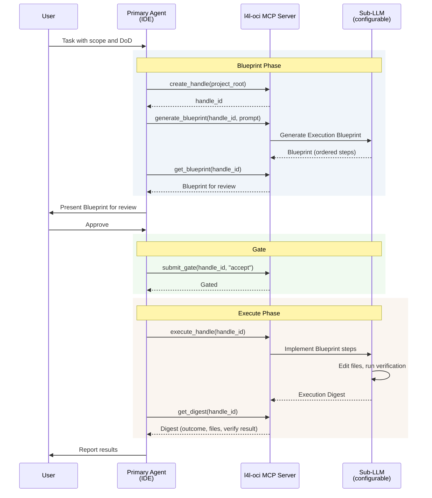

# Agent Skills Hub

[](https://www.npmjs.com/package/@flitzrrr/agent-skills)
[](https://www.npmjs.com/package/@flitzrrr/agent-skills)
[](skills/)
[](vendor/)
[](LICENSE)
[](.github/workflows/skill-discovery.yml)

**504 curated AI agent skills** from **19 verified sources**. One install, every major coding assistant.

[Full catalog](https://flitzrrr.github.io/agent-skills/) | [Decision guide](CHEATSHEET.md)

---

## Quick Start

```bash
npx @flitzrrr/agent-skills install
```

Detects installed platforms and provisions skills for each. Target a single platform with:

```bash
npx @flitzrrr/agent-skills install <platform>
```

Where `<platform>` is one of: `vscode`, `codex`, `antigravity`, `opencode`.

<details>
<summary>Manual setup (git clone)</summary>

```bash
git clone --recurse-submodules git@github.com:flitzrrr/agent-skills.git
cd agent-skills

# Symlink into target platform(s):
ln -sf $(pwd)/skills/* ~/.copilot/skills/         # VS Code / GitHub Copilot
ln -sf $(pwd)/skills/* ~/.codex/skills/            # Codex
ln -sf $(pwd)/skills/* ~/.gemini/antigravity/skills/ # Antigravity
ln -sf $(pwd)/skills/* ~/.config/opencode/skills/  # OpenCode

# Pull upstream updates:
git submodule update --remote --merge
```

</details>

<details>
<summary>All CLI commands</summary>

| Command | Description |
| --- | --- |
| `npx @flitzrrr/agent-skills install` | Install for all detected platforms |
| `npx @flitzrrr/agent-skills install <platform>` | Install for a single platform |
| `npx @flitzrrr/agent-skills update` | Pull latest upstream skills |
| `npx @flitzrrr/agent-skills list` | List all available skills |

</details>

---

## Platform Support

| Platform | Discovery Mechanism | Install Method |
| --- | --- | --- |
| VS Code (GitHub Copilot) | `.github/copilot-instructions.md` + `~/.copilot/skills/` | `install vscode` |
| Claude Code | `CLAUDE.md` (project-level) | Clone into project |
| Codex | `AGENTS.md` | `install codex` |
| Cursor | `.cursorrules` (project-level) | Clone into workspace |
| Lovable | `.lovable` | Clone into workspace |
| Windsurf | `AGENTS.md` | Clone into workspace |
| Antigravity | `~/.gemini/antigravity/skills/` | `install antigravity` |
| OpenCode | `AGENTS.md` + `skills/` | `install opencode` |
| Any agent | Read `skills/<name>/SKILL.md` directly | Manual |

---

## Skill Categories

| Category | Examples | Sources |
| --- | --- | --- |
| Security and code review | `security-review`, `code-review`, `find-bugs`, `gha-security-review` | Sentry, Trail of Bits |
| Git workflow | `commit`, `create-branch`, `pr-writer`, `iterate-pr` | Sentry |
| Project planning | `create-plan`, `resume-plan`, `execute-work-package`, `generate-handover` | DasDigitaleMomentum |
| Document generation | `anthropic-pdf`, `anthropic-docx`, `anthropic-pptx`, `anthropic-xlsx` | Anthropic |
| Frontend and React | `vercel-react-best-practices`, `vercel-web-design-guidelines`, `anthropic-frontend-design` | Vercel, Anthropic |
| Infrastructure | `aws-lambda`, `terraform-code-generation`, `cloudflare-wrangler` | AWS, HashiCorp, Cloudflare |
| Finance | `finance-equity-research`, `finance-ib-advisory`, `finance-wealth-mgmt` | Anthropic |
| Science and ML | `scientific-bioinformatics`, `scientific-alphafold`, `scientific-chembl` | K-Dense-AI |
| Marketing and SEO | `content-strategy`, `seo-audit`, `product-description-seo` | Coreyhaines, Bhanunamikaze |
| Developer tools | `anthropic-mcp-builder`, `anthropic-webapp-testing`, `systematic-debugging` | Anthropic, Sentry |
| Django | `django-access-review`, `django-perf-review` | Sentry |
| Deployment | `vercel-deploy-to-vercel`, `stitch-shadcn-ui` | Vercel, Google |

See [CHEATSHEET.md](CHEATSHEET.md) for a decision guide on which skill to use for a given task.

---

## Sources

| Source | Skills | Focus |
| --- | ---: | --- |
| [K-Dense-AI/claude-scientific-skills](https://github.com/K-Dense-AI/claude-scientific-skills) | 175 | Science, bioinformatics, ML, chemistry |
| [trailofbits/skills](https://github.com/trailofbits/skills) | 60 | Security auditing, static analysis, smart contracts |
| [anthropics/financial-services-plugins](https://github.com/anthropics/financial-services-plugins) | 56 | Finance: IB, equity research, PE, wealth mgmt |
| [MoizIbnYousaf/Ai-Agent-Skills](https://github.com/MoizIbnYousaf/Ai-Agent-Skills) | 48 | Database design, debugging, code patterns |
| [coreyhaines31/marketingskills](https://github.com/coreyhaines31/marketingskills) | 33 | Marketing: SEO, email, content, analytics |
| [getsentry/skills](https://github.com/getsentry/skills) | 24 | Security, code review, Git workflow, Django |
| [itsmostafa/aws-agent-skills](https://github.com/itsmostafa/aws-agent-skills) | 18 | AWS infrastructure and services |
| [anthropics/skills](https://github.com/anthropics/skills) | 17 | Document gen, creative design, MCP |
| [hashicorp/agent-skills](https://github.com/hashicorp/agent-skills) | 14 | Terraform generation |
| [expo/skills](https://github.com/expo/skills) | 11 | Expo design and deployment |
| [cloudflare/skills](https://github.com/cloudflare/skills) | 9 | Workers, Durable Objects, MCP |
| [DasDigitaleMomentum/opencode-processing-skills](https://github.com/DasDigitaleMomentum/opencode-processing-skills) | 9 | Multi-session planning |
| [google-labs-code/stitch-skills](https://github.com/google-labs-code/stitch-skills) | 7 | Design-to-code, shadcn/ui, Remotion |
| [vercel-labs/agent-skills](https://github.com/vercel-labs/agent-skills) | 5 | React, Next.js, web design |
| [callstackincubator/agent-skills](https://github.com/callstackincubator/agent-skills) | 5 | React Native, GitHub workflows |
| [JackyST0/awesome-agent-skills](https://github.com/JackyST0/awesome-agent-skills) | 5 | General-purpose agent patterns |
| [stripe/ai](https://github.com/stripe/ai) | 2 | Stripe best practices |
| [Bhanunamikaze/Agentic-SEO-Skill](https://github.com/Bhanunamikaze/Agentic-SEO-Skill) | 1 | SEO auditing (16 sub-skills) |
| [supabase/agent-skills](https://github.com/supabase/agent-skills) | 1 | Postgres best practices |

New sources are discovered weekly via [GitHub Actions](.github/workflows/skill-discovery.yml) and security-scanned before integration.

---

## Architecture

```
agent-skills/
  skills/            504 entries (symlinks to vendor + local forks)
  vendor/          20 Git submodules (upstream sources)
  bin/               CLI and build scripts
  docs/              GitHub Pages catalog and project documentation
  .github/           CI workflows and copilot-instructions.md
```

Skills are exposed as a flat directory under `skills/`. Most entries are symlinks into `vendor/` submodules. Skills with local extensions (e.g., `execute-work-package` with multi-transport support) are maintained as real directories alongside the symlinks.

### Naming Convention

Skills are namespaced by source to avoid collisions: `anthropic-pdf`, `tob-static-analysis`, `cloudflare-wrangler`, `terraform-code-generation`, `scientific-bioinformatics`, `aws-lambda`, `finance-equity-research`, `callstack-react-native-best-practices`. Sentry and marketing skills are un-prefixed (`code-review`, `content-strategy`).

### Automation

| Workflow | Trigger | Purpose |
| --- | --- | --- |
| [Skill Discovery](.github/workflows/skill-discovery.yml) | Weekly | Find trending skill repos, security-scan, auto-add |
| [Submodule Update](.github/workflows/submodule-update.yml) | Weekly | Pull upstream changes, open PR |
| [MegaLinter](.github/workflows/megalinter.yml) | Push / PR | Lint markdown, YAML, JSON |
| [npm Publish](.github/workflows/npm-publish.yml) | Tag `v*` | Publish to npm, create GitHub Release |

---

## MCP Execution Backend (l4l-oci)

The [execute-work-package](skills/execute-work-package) skill supports three transport modes for delegating implementation to a sub-agent:

| Transport | Mechanism | When to use |
| --- | --- | --- |
| **MCP via l4l-oci** (default) | [l4l-oci](https://github.com/DasDigitaleMomentum/l4l-oci) exposes 10 MCP tools for the gated blueprint-gate-execute lifecycle | Any IDE with MCP support |
| **Fresh Agent** | IDE spawns a new sub-agent per step (no external server) | Fallback when l4l-oci is not configured |
| **Stateful Session** | Sub-agent session resumed across steps | OpenCode only |

When l4l-oci MCP tools are available (`create_handle`, `generate_blueprint`, `submit_gate`, `execute_handle`, `get_digest`), the skill uses them automatically. The bundled `scripts/start-l4l-oci.sh` auto-starts the server if needed. See the [l4l-oci setup guide](https://github.com/DasDigitaleMomentum/l4l-oci/blob/main/docs/setup.md) for configuration.

### Lifecycle



---

## License

MIT -- applies to the CLI, workflows, and documentation in this repository.
Each vendored submodule in `vendor/` retains its own original license.
